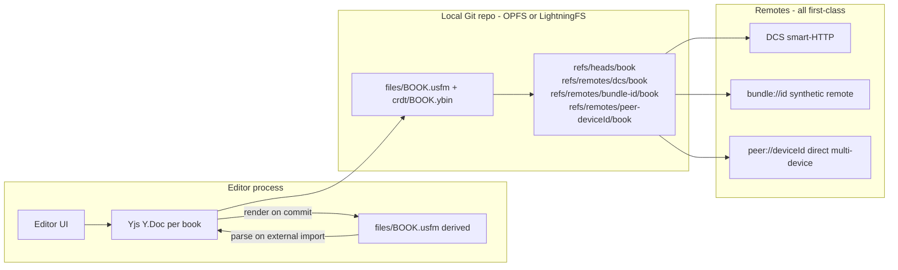
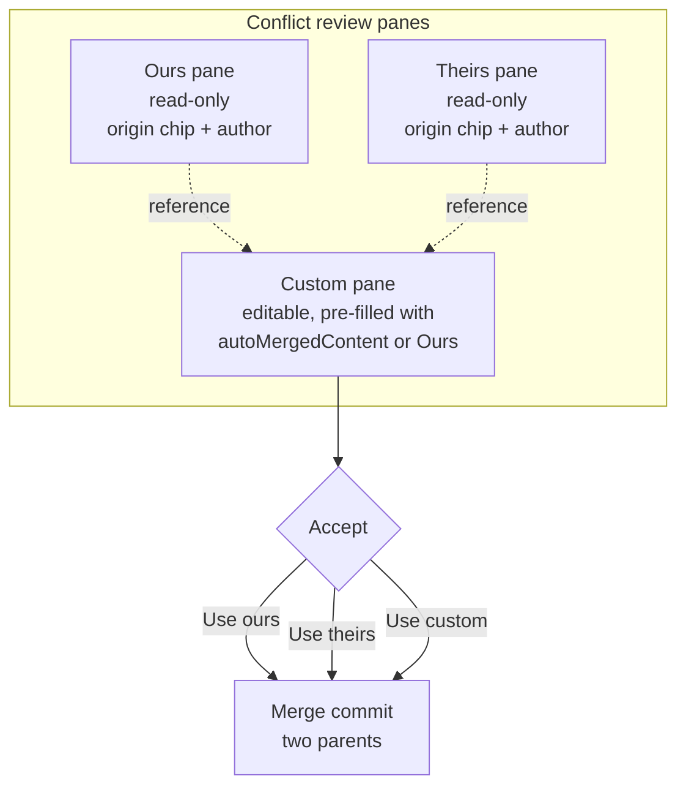
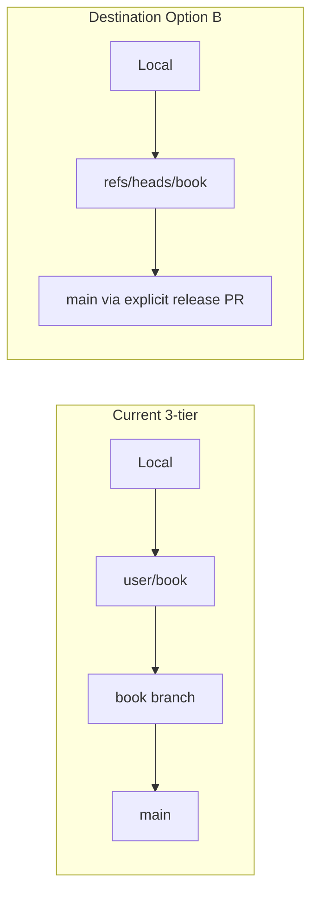

# Unified sync and conflict-handling model

**Status:** destination architecture (proposal — no implementation in this document).  
**Related:** [29-bidirectional-sync.md](./29-bidirectional-sync.md) describes the current shipped behavior.

---

## 1. Frame and goals

Every conflict in this system — real-time edit, offline divergence, online sync, bundle import, multi-device handoff, PR resolved on DCS — is the **same kind of object**: a three-way merge between two commit OIDs over a known merge-base, where most content merges automatically (CRDT) and the user only sees a conflict editor when intent is genuinely ambiguous.

**Goals:**

| Goal | Statement |
|------|-----------|
| **One merge primitive** | All conflict surfaces resolve through `merge-base(ours, theirs)` → per-path driver → merge commit. |
| **One base concept** | Merge-base comes from object reachability in the local Git repo, not from stored REST anchors. |
| **One history** | Local Git repo (isomorphic-git + browser FS) is the single source of truth. Remote DCS, bundles, and peers are just named remotes. |
| **One conflict object / UI** | Every conflict produces a `MergeAttempt`; the 3-pane UX (Ours / Theirs / Custom) renders it regardless of origin. |
| **Offline is the default** | Editing works entirely without connectivity. "Online" means a remote happens to be reachable. |
| **Silent CRDT merges** | CRDT-merged content (Yjs applyUpdate) does not surface as a conflict unless the user explicitly enters a review flow. |
| **Peer sync is a first-class remote** | Multi-device sync uses the same fetch → merge-base → per-path merge → push cycle as DCS sync. |

---

## 2. Conflict surfaces today (and what is wrong with each)

Each surface today invents its own base anchor and conflict representation. They do not converge.

| Surface | Key files | Problem |
|---------|-----------|---------|
| Online sync | [`packages/usfm-editor-app/src/lib/dcs-project-sync.ts`](../packages/usfm-editor-app/src/lib/dcs-project-sync.ts), [`packages/usfm-editor-app/src/hooks/useLocalProjectSync.ts`](../packages/usfm-editor-app/src/hooks/useLocalProjectSync.ts) | `base = meta.lastRemoteCommit?.[tier2]` — not a true merge-base; spurious conflicts on already-merged content. |
| Per-path merge | [`packages/usfm-editor-adapters/src/three-way-merge-project.ts`](../packages/usfm-editor-adapters/src/three-way-merge-project.ts) | OT bridge (`diffUsjDocuments` + `transformOpLists`) produces false overlaps when divergence is long; no concept of merge-base OID. |
| Bundle import | `bundle-import-snapshot.ts`, `bundle-import-rollback.ts`, `open-project-bundle.ts`, `project-bundle.ts` | Completely separate code path; no connection to sync conflict objects. |
| Real-time OT collab | `HeadlessCollabSession`, `scripture-session.ts`, journal `ProjectBookJournalStore` | In-session OT is correct; handoff on save has no shared history with remote sync, so the next sync can re-conflict the same changes. |
| Conflict state | `pendingConflicts` on `ProjectMeta`; `SyncConflictDialog`, `ChapterConflictReviewPanel`, `ConflictSolverPanel`, `BookConflictsContext`; renderers in [`packages/usfm-editor-app/src/components/conflict-renderers/`](../packages/usfm-editor-app/src/components/conflict-renderers/) | Long-lived on `ProjectMeta`; spurious conflicts block further auto-sync; each renderer is an independent ad-hoc format. |
| Multi-device same user | Not modeled | Handled accidentally via shared DCS book branch; no explicit reconciliation. |

---

## 3. Why the REST + ancestry patch alone is not the destination

The ancestry-aware sync algorithm described in §5.1 (Phase 1 of the migration) fixes the immediate "older-remote-as-conflict" bug. It is **not** the destination because:

- It adds a third REST-anchor concept (`lastPushedCommit`, `lastMergedBaseCommit`, `lastRemoteCommit`) that must be kept consistent across every code path — an invariant that is hard to maintain.
- Bundle import, multi-device, and PR-resolved-on-DCS still need bespoke reconciliation outside the ancestry model.
- OT-as-bridge between snapshots produces spurious "overlap" conflicts whenever divergence is long. With two devices offline for days and then reconnecting, OT will flag conflicts that CRDTs would silently resolve.
- It does not give us a local history, per-book diff, blame, undo-across-sessions, or the ability to "revert this chapter."

---

## 4. Recommendation: local Git + CRDT as source of truth + USFM as derived serialization



### 4.1 Storage layer

`isomorphic-git` over a browser FS. **OPFS** (Origin Private File System) is preferred where available (Chrome, Edge, Firefox); **LightningFS** over IndexedDB is the fallback (Safari, older browsers). The Node-only adapter at [`packages/usfm-editor-core/src/persistence/git-local-adapter.ts`](../packages/usfm-editor-core/src/persistence/git-local-adapter.ts) is the reference implementation; the browser adapter follows the same `PersistenceAdapter` interface.

The existing `GitSyncAdapter` interface at [`packages/usfm-editor-core/src/git-sync-adapter.ts`](../packages/usfm-editor-core/src/git-sync-adapter.ts) exposes `commit`, `checkout`, `diffRevisions`, and `merge(base, ours, theirs)` — the exact surface needed for the per-book merge step.

### 4.2 In-editor model: Yjs CRDT

The in-editor document model moves from "snapshot serialized to USFM" to a **structured Yjs CRDT** per book. OT is retained inside real-time sessions during the migration (Phase 4 replaces it). The CRDT state — not the USFM text — is the source of truth.

### 4.3 Git-tracked files per book

Two complementary blobs per book:

| File | Role |
|------|------|
| `files/<BOOK>.usfm` | Derived, human-readable, tooling-compatible (Paratext, Proskomma, etc.). Diff-friendly in `git log`. Updated on every commit. |
| `crdt/<BOOK>.ybin` | Binary Yjs state (encoded with `Y.encodeStateAsUpdateV2`). Source of truth for live editing. Merged by `Y.applyUpdate`. |

### 4.4 Per-path merge driver

When merging two trees, dispatch by file pattern:

| Pattern | Merge action |
|---------|--------------|
| `crdt/*.ybin` | `Y.applyUpdate(ours, theirsBytes)` → re-encode → re-render USFM. No conflict in the Git sense; concurrent edits to the same range converge. |
| `files/*.usfm` | If accompanying `.ybin` exists on both sides, treat USFM as derived — skip file-level merge; the `.ybin` merge already produced the correct USFM. If only one side has `.ybin` (e.g. a Paratext push to DCS without CRDT), parse the foreign USFM into a transient `Y.Doc`, diff against the last-known shared CRDT state, and apply as a CRDT transaction. |
| `journal/*.jsonl` | Existing union-by-id with per-replica vector-clock `max` (already CRDT-shaped; keep as-is). |
| `*.json` / `*.yaml` | Existing object/key merge from `mergeProjectMaps`. |
| Anything else | Git default text merge; if it conflicts, surface to the 3-pane UI. |

### 4.5 Three remotes — all first-class

| Remote name | Transport | Notes |
|-------------|-----------|-------|
| `dcs` | DCS smart-HTTP (Gitea) | Shallow `depth: 1`, `singleBranch: true`, `noTags: true`. |
| `bundle-<id>` | Synthetic — materialized from a bundle file's file tree, written into the local repo as a commit, then treated as a normal remote ref. | A strictly-older bundle is detected as ancestor → noop. |
| `peer-<deviceId>` | Packfile-over-file (Phase 7 first mode); WebRTC/LAN (Phase 7 second mode). | DCS remains source of truth; peer sync is an optimization for offline meetups. |

---

## 5. CRDT model: Yjs schema for USFM

### 5.1 Document root

One `Y.Doc` per book, keyed by `projectId:bookCode`.

### 5.2 Top-level structure

```
Y.Doc
├── body: Y.Array<Paragraph>
└── identification: Y.Map<string, unknown>   // \id, \h, \toc1-3, \mt, etc.
```

### 5.3 Paragraph

```
Paragraph = Y.Map {
  kind: '\p' | '\q1' | '\q2' | '\s1' | ... // USFM paragraph marker
  content: Y.Array<Span>
}
```

### 5.4 Span types

| Span kind | Shape |
|-----------|-------|
| Editable text | `Y.Map { type: 'text', text: Y.Text }` |
| Verse number | `Y.Map { type: 'verse', number: string }` |
| Milestone | `Y.Map { type: 'milestone', kind: string, attrs: Y.Map }` |
| Footnote / cross-ref | `Y.Map { type: 'note', callerText: string, children: Y.Array<Span> }` |
| Character style | `Y.Map { type: 'char', kind: '\nd' | '\wj' | ..., children: Y.Array<Span> }` |

### 5.5 Alignment

Word-level alignment is stored as an attribute map on each word `Y.Text` node (using Yjs formatting attributes). Alignments survive concurrent text edits without losing their anchor because Yjs preserves formatting attributes alongside text positions.

### 5.6 Tombstones and garbage collection

Use Yjs's built-in tombstone GC (enabled by default). Disable for books where the user wants full undo history across sessions — document this as a per-project option.

### 5.7 Encoding and merge

```
Snapshot (Git object):  Y.encodeStateAsUpdateV2(doc)   → crdt/<BOOK>.ybin
Merge two replicas:     Y.applyUpdate(oursDoc, theirsBytes)
                        → re-encode → write crdt/<BOOK>.ybin
                        → re-render files/<BOOK>.usfm
```

### 5.8 Compaction

On each successful sync push, re-encode the CRDT from current state (dropping accumulated update entries) before committing. This keeps the `.ybin` size proportional to current document size rather than edit history.

### 5.9 Paratext compatibility shim

When fetching a remote that updated only `files/<BOOK>.usfm` with no matching `crdt/<BOOK>.ybin` change:

1. Parse the incoming USFM into a transient `Y.Doc` (using the USFM ⇄ Yjs codec).
2. Compute the diff against our last-known-shared CRDT state (the merge-base `.ybin`).
3. Apply as a CRDT transaction to our live `Y.Doc`.
4. Re-encode and re-render normally.

**Fidelity tradeoff:** round-trip USFM → CRDT → USFM is not byte-stable (whitespace, attribute ordering). Document which round-trip changes are acceptable and keep a Paratext interop CI fixture.

---

## 6. Unified conflict object and 3-pane UX

### 6.1 MergeAttempt type

```typescript
type MergeAttempt = {
  sourceOid: string;         // the remote commit OID
  targetOid: string;         // our local commit OID
  baseOid: string;           // true merge-base from object reachability
  perFile: FileConflict[];
  origin: 'sync' | 'bundle' | 'peer' | 'pr' | 'review';
};

type FileConflict = {
  path: string;
  kind: 'usfm-chapter' | 'json-key' | 'yaml-key' | 'plain-text';
  oursContent: string;
  theirsContent: string;
  autoMergedContent: string | null;  // CRDT or heuristic result; null if no auto-merge
  oursOrigin: OriginChip;
  theirsOrigin: OriginChip;
};

type OriginChip = {
  label: 'sync' | 'bundle' | 'peer' | 'pr' | 'review';
  author?: string;
  timestamp?: string;
};
```

`MergeAttempt` lives **only** while a merge is in flight or pending user resolution. It is **not** a long-lived field on `ProjectMeta`.

### 6.2 3-pane conflict UX



**Ours** and **Theirs** are read-only. Each has an origin chip (where the change came from: sync, bundle, peer, pr, review) and the author identity when available.

**Custom** is fully editable using the **same editor component** as normal translation work — USFM affordances (verses, footnotes, alignment), not a plain textarea. It is pre-filled with `autoMergedContent` when available (CRDT-merged or heuristic result); otherwise pre-filled with Ours so the user does not start from a blank pane.

**Live diff badges** in the Custom pane highlight verses, words, or footnotes present in Ours or Theirs but missing in the current Custom content. This prevents accidental drops.

**Accept buttons:**

| Action | Result |
|--------|--------|
| Use ours | Replace Custom content with Ours; commit as merge commit. |
| Use theirs | Replace Custom content with Theirs; commit as merge commit. |
| Use custom | Commit Custom content as merge commit. |

All three actions produce a **merge commit with two parents** (`sourceOid` and `targetOid`). The merge commit is then pushed with CAS.

### 6.3 Per-conflict-kind renderer

| FileConflict kind | Editor in Custom pane |
|-------------------|-----------------------|
| `usfm-chapter` | Full USFM editor (existing `UsfmChapterDiffView` promoted to an editable editor) |
| `json-key` | Key-value editor (existing `JsonKeyDiffView` extended with edit affordance) |
| `yaml-key` | Key-value editor (`YamlKeyDiffView` extended) |
| `plain-text` | Plain textarea with line diff gutter |

### 6.4 Crash recovery

In-progress merges are reconstructable from refs (`MERGE_HEAD`, `ORIG_HEAD`) on reload. `pendingConflicts` on `ProjectMeta` is no longer written. If the user reloads mid-conflict, the app reads `MERGE_HEAD` from the local Git repo and reconstructs a `MergeAttempt` to show the same 3-pane view.

### 6.5 CRDT silent merges

When `crdt/*.ybin` merges automatically (no content loss per CRDT semantics), no conflict pane appears. The 3-pane UX only triggers for non-CRDT files, external (Paratext) USFM-only updates that could not round-trip cleanly, or when the user explicitly opens a "review concurrent edits" flow.

---

## 7. End-to-end flows under the destination model

```mermaid
sequenceDiagram
  participant E as Editor (Yjs)
  participant L as Local Git
  participant R as Remote (DCS / Bundle / Peer)
  E->>L: commit on refs/heads/book (writes .usfm + .ybin)
  Note over L: offline = stop here (real local commits)
  L->>R: fetch refs/remotes/<r>/book
  L->>L: merge-base(local, remote) via object reachability
  alt remote is ancestor of local
    L-->>E: noop; push local ahead if dirty
  else divergent
    L->>L: per-path merge driver (CRDT applyUpdate + mergeProjectMaps)
    alt all files merged cleanly
      L->>L: merge commit (two parents), push
    else non-CRDT file has unresolvable diff
      L-->>E: MergeAttempt -> 3-pane conflict UI
      E->>L: resolve (Use ours / Use theirs / Use custom)
      L->>L: merge commit (two parents), push
    end
  end
```

### 7.1 Offline edits

Real local commits on `refs/heads/{book}` (writing both `.usfm` and `.ybin`). Coming online is just `fetch + merge + push`. There is no "what did the user do offline" reconstruction — the commits are already there.

### 7.2 Bundle import

`open-project-bundle.ts` materializes the bundle's file tree as a commit written to `refs/remotes/bundle-<id>/{book}` (a synthetic remote ref). The fetch+merge cycle then runs identically to a DCS sync. A strictly-older bundle (its commit is an ancestor of local head) → noop.

### 7.3 Multi-device (peer transport)

Each device holds a local Git clone with `refs/remotes/dcs/{book}` and optionally `refs/remotes/peer-<deviceId>/{book}`. The peer sends a packfile containing commits since the last shared ancestor; the receiving device applies it and runs the standard fetch+merge cycle. DCS remains the source of truth; peer sync is an optimization for offline meetups or slow connections.

### 7.4 PR resolved on DCS

The DCS book branch advances after the merge. The next local fetch sees the new `refs/remotes/dcs/{book}` head; `Y.applyUpdate` handles content; no special anchor reconciliation needed.

### 7.5 Real-time OT collab (during migration)

Unchanged inside a session during Phase 1–3. On save, the session produces commits like any other source. Phase 4 migrates the in-session model to a shared `Y.Doc` with Yjs awareness; at that point cross-session conflicts also disappear at the editing layer.

---

## 8. Branch model

Option B: per-book branch only. Tier-1 user branches (`{username}/{book}`) are dropped.



With local Git, Tier-1 branches add no value: per-author commits in the local repo give the same audit trail; ref-CAS on the book branch serializes concurrent pushes. `autoMergeToDcs` (Tier-1 → Tier-2 → main) is retired; promotion to `main` becomes an explicit release operation.

---

## 9. Storage, performance, and platform notes

### 9.1 Clone options

```
depth: 1, singleBranch: true, noTags: true
```

Partial-clone filters (`--filter=blob:none`) where Gitea supports them. Full history is behind a user-triggered "load history" action.

### 9.2 Browser FS

| Platform | FS layer |
|----------|----------|
| Chrome, Edge, Firefox | **OPFS** (Origin Private File System) — fastest, native async I/O |
| Safari / older | **LightningFS** over IndexedDB — compatible fallback |

Detection: `typeof navigator.storage?.getDirectory === 'function'`.

### 9.3 Storage quota and eviction

Browser can evict OPFS/IndexedDB under storage pressure. The mitigation is a first-class **reclone flow**: detect missing or corrupted repo, reclone from DCS, replay commits in the local "outbox" (unpushed commits stored in `ProjectMeta` until confirmed on DCS). The reclone flow is not an error path; it is a documented recovery operation.

### 9.4 Multi-tab

`BroadcastChannel` + leader election per `(projectId, bookCode)`: only the leader tab fetches and pushes. Other tabs receive ref-update events via the channel and update their Yjs awareness. Yjs cross-tab sync also rides the same channel.

### 9.5 CRDT footprint and compaction

Yjs update logs grow with edit history. Compact on every successful sync push: re-encode the current CRDT state using `Y.encodeStateAsUpdateV2` and write the result as the new `.ybin` blob in the commit, discarding accumulated update entries. This keeps `.ybin` size proportional to document size rather than lifetime edit count.

### 9.6 Pack maintenance

Schedule `git gc` (Gitea smart-HTTP does not expose this; use `isomorphic-git`'s packfile pruning) on idle / on app focus when the last GC was more than 7 days ago.

---

## 10. Migration phases

Cost is not the constraint. Each phase ships behind a per-project feature flag and can be independently rolled back.

### Phase 1 — REST + ancestry anchors (interim bug fix, scaffolding)

**Goal:** Stop the "older-remote-as-conflict" bug immediately while the destination is built.

**Changes:** Add `lastPushedCommit[ref]` and `lastMergedBaseCommit[ref]` to `ProjectMeta` (in [`packages/shared-types/src/project/storage.ts`](../packages/shared-types/src/project/storage.ts)). In [`dcs-project-sync.ts`](../packages/usfm-editor-app/src/lib/dcs-project-sync.ts), call `compareRefs(base: lastPushedCommit, head: theirs)` before merging; if `totalCommits === 0`, skip the full tree pull. Use the API-returned merge-base OID as the actual `base` for `mergeProjectMaps`. Introduce a module-level `Map<key, Promise>` mutex so at most one sync runs per `(projectId, bookCode)` at a time. Full pseudocode:

```
theirs = head(bookBranch)
if no local delta && theirs == lastPushedCommit[ref]: return noop

cmp = compareRefs(base: lastPushedCommit[ref], head: theirs)
if cmp.totalCommits == 0:
  if localDirty: push with CAS; update lastPushedCommit
  return

mergeBaseOid = <from Gitea compare API or dedicated merge-base endpoint>
baseFiles = pullFilesAt(mergeBaseOid)
theirsFiles = pullFilesAt(theirs)
oursFiles = gatherLocalMap()
{ merged, conflicts } = mergeProjectMaps(baseFiles, oursFiles, theirsFiles)
if conflicts: double-check with recomputed base; persist only surviving conflicts
push with CAS; on success: lastPushedCommit = newHead; lastMergedBaseCommit = mergeBaseOid
```

**Does not address:** bundle import, multi-device, long-divergence OT conflicts, persisted `pendingConflicts`.

### Phase 2 — Browser-FS + DCS Git transport

Implement a browser `GitLocalPersistenceAdapter` over OPFS/LightningFS. Implement `DcsGitProjectSync` (`GitSyncAdapter`) that clones (shallow, singleBranch), fetches, and pushes with ref-CAS via DCS smart-HTTP. Land the per-path merge driver wrapping `mergeProjectMaps` (plus `Y.applyUpdate` stub for `.ybin`). Gate by per-project feature flag.

### Phase 3 — Unified MergeAttempt + 3-pane UX

**Partial ✓ — `ThreePaneConflictView` + Custom mode delivered.**

- **Delivered:** `packages/usfm-editor-app/src/components/conflict-renderers/ThreePaneConflictView.tsx` — Ours (read-only) | Theirs (read-only) | Custom (editable) layout. Pre-populates the editable pane from the auto-stitch result (or `oursText` as fallback). Shows live line-diff badges against Ours/Theirs. Copy-from-side buttons.
- **Delivered:** `ConflictSolverPanel` extended with a `'custom'` mode (Pencil button, keyboard shortcut `3`). When custom mode is active, `ThreePaneConflictView` replaces the paragraph-pick renderer; applying calls `onResolve(path, 'merged', customText)`.

**Still pending:**
- Introduce `MergeAttempt` in `shared-types` as a typed carrier for three-way merge outcomes.
- Rewire `ChapterConflictReviewPanel` to consume `MergeAttempt`.
- Route bundle import through the same conflict primitive.
- Remove persisted `pendingConflicts` from `ProjectMeta` (gated on full CRDT phase).

### Phase 4 — CRDT (Yjs) as in-editor model

Define the Yjs schema for USFM (§5). Implement the USFM ⇄ Yjs codec (new module in `usfm-editor-core` or a new `usfm-yjs` package, living next to `usj-to-pm.ts`). Introduce `crdt/<BOOK>.ybin` alongside `files/<BOOK>.usfm` in the Git-tracked tree. Teach the per-path merge driver to do `Y.applyUpdate` for `.ybin` and re-render USFM. Migrate `HeadlessCollabSession` to share the same `Y.Doc` with Yjs awareness for live cursors and cross-tab sync.

### Phase 5 — Switch sync orchestration to Git + CRDT

Flip [`useLocalProjectSync`](../packages/usfm-editor-app/src/hooks/useLocalProjectSync.ts) and [`dcs-project-sync.ts`](../packages/usfm-editor-app/src/lib/dcs-project-sync.ts) to call the Git adapter with the CRDT-aware merge driver. Keep REST as a transport fallback for environments without smart-HTTP access. Validate all acceptance criteria (§11).

### Phase 6 — Decommission REST anchors and OT bridges

Remove:
- Per-blob CAS (`expectedBaseShaByPath` push loop).
- `lastRemoteCommit`, `lastPushedCommit`, `lastMergedBaseCommit` from `ProjectMeta`.
- Persisted `pendingConflicts`.
- Tier-1 branch creation and the `autoMergeToDcs` Tier-1 → Tier-2 hop.
- The snapshot-OT bridge in `three-way-merge-project.ts` (`diffUsjDocuments` + `transformOpLists`); the per-key/object merges (`journal/*.jsonl`, `*.json`, `*.yaml`) remain.

All sync logic collapses to: ref OIDs, object reachability, `Y.applyUpdate`, `mergeProjectMaps` for non-CRDT file kinds.

### Phase 7 — Peer transport (first-class)

**First mode:** "import packfile from file" — lowest friction, works without any network signaling. The sending device exports a packfile containing commits since the last shared ancestor; the receiving device imports it and runs the standard fetch+merge cycle.

**Second mode:** WebRTC / LAN discovery — adds real-time peer negotiation for devices on the same network.

Expose a `peer://` remote in the `GitSyncAdapter` surface. Implement `PeerProjectSync` alongside `DcsGitProjectSync`. Multi-device merging is now `Y.applyUpdate` end-to-end — no special handling beyond the standard merge cycle.

---

## 11. Acceptance criteria (all six conflict surfaces)

1. Strictly-older remote (online, bundle, or peer) **never** produces a conflict pane purely from tree replay.
2. Two clients editing **different chapters** of the same book — one or both offline at the time — sync without conflicts when they reconnect, in any order.
3. Two clients editing **the same chapter** concurrently produce a CRDT-merged result silently when the edits are non-overlapping; overlapping concurrent edits surface in the 3-pane UX with a Custom pane pre-filled with the CRDT-merged text.
4. Bundle import of an older snapshot is a noop; bundle import of a divergent snapshot uses the **same** 3-pane conflict UI as online sync.
5. PR resolved on DCS converges in the next sync without manual local action.
6. The same `MergeAttempt` type and 3-pane renderer are used for every conflict surface listed in §2.
7. After a crash mid-merge, reloading the app reconstructs the in-progress merge from refs (`MERGE_HEAD`, `ORIG_HEAD`) — no orphaned `pendingConflicts`.
8. Multi-tab: at most one fetch/push in flight per `(projectId, bookCode)` across tabs, enforced via `BroadcastChannel` leader election.
9. Two devices of the same user, both with offline edits, sync directly via peer transport (Phase 7) and produce the same merged history they would produce via DCS.
10. The Custom pane: (a) is editable with the same affordances as normal editing, (b) is pre-filled with `autoMergedContent` when one exists, (c) shows live diff badges against Ours and Theirs, (d) commits its content as a merge commit with two parents.
11. A USFM-only update from an external client (e.g. Paratext) round-trips through the CRDT shim and produces a merged tree without losing alignment metadata recorded in our CRDT — within documented fidelity bounds.

---

## 12. Risks and mitigations

| Risk | Mitigation |
|------|------------|
| Browser storage quota / eviction | Reclone-from-DCS + replay outbox is a first-class flow, not an error path. Unpushed commits are tracked in a separate outbox until confirmed on DCS. |
| Smart-HTTP perf for large repos | Mandatory shallow + singleBranch. Full history is behind a user-triggered "load history" action. |
| iOS / Safari quirks (OPFS, IndexedDB) | Ship LightningFS fallback; gate by `typeof navigator.storage?.getDirectory`. |
| Yjs schema design for USFM | Biggest design risk. Mitigate by prototyping with one book and a few paragraph kinds before broad rollout. ProseMirror-Yjs binding patterns are the reference. |
| USFM ⇄ Yjs codec fidelity | Document non-byte-stable round-trip. Prefer CRDT-side editing once introduced. Keep Paratext interop as a CI fixture. |
| Custom merge driver complexity | Already exists as `mergeProjectMaps`; the wrapping is mechanical. |
| Backwards compatibility | Phase 1 keeps REST working. Later phases gated by feature flag per project. Phase 6 only after Phase 5 has soaked in production. |
| Peer transport security | Packfiles imported from file are treated like any other remote (must pass merge-base check before fast-forward). WebRTC/LAN gated behind explicit pairing (QR code or shared passphrase). |

---

## 13. Out of scope

- Real-time relay protocol design (still a separate problem from sync).
- Release / tag promotion workflow (only mentioned where relevant to `main`).
- Server-side changes to DCS / Gitea.

---

## 14. Implementation touchpoints (for follow-up code plans)

| Package / area | What changes |
|----------------|-------------|
| [`packages/shared-types/src/project/storage.ts`](../packages/shared-types/src/project/storage.ts) | Add `lastPushedCommit`, `lastMergedBaseCommit` (Phase 1); add `outbox` for unpushed commits (Phase 2); remove Phase 1 fields (Phase 6). |
| [`packages/usfm-editor-app/src/lib/dcs-project-sync.ts`](../packages/usfm-editor-app/src/lib/dcs-project-sync.ts) | Phase 1 ancestry anchors; Phase 5 switch to Git adapter; Phase 6 decommission. |
| [`packages/usfm-editor-app/src/hooks/useLocalProjectSync.ts`](../packages/usfm-editor-app/src/hooks/useLocalProjectSync.ts) | Phase 1 global mutex; Phase 5 Git adapter wiring; Phase 6 simplify. |
| [`packages/usfm-door43-rest/src/pulls.ts`](../packages/usfm-door43-rest/src/pulls.ts) | Phase 1: extend `compareRefs` result to parse merge-base commit OID from Gitea compare response if available. |
| [`packages/usfm-editor-adapters/src/storage/dcs-rest-project-sync.ts`](../packages/usfm-editor-adapters/src/storage/dcs-rest-project-sync.ts) | Phase 2: add `DcsGitProjectSync` as a sibling implementing `GitSyncAdapter`. Phase 6: retire CAS-push path. |
| [`packages/usfm-editor-adapters/src/three-way-merge-project.ts`](../packages/usfm-editor-adapters/src/three-way-merge-project.ts) | Phase 4: add CRDT dispatch to per-path merge driver. Phase 6: remove OT bridge. |
| New `usfm-yjs` package or subpath in `usfm-editor-core` | Phase 4: Yjs schema for USFM + USFM ⇄ Yjs codec, next to `usj-to-pm.ts`. |
| [`packages/usfm-editor-app/src/components/conflict-renderers/`](../packages/usfm-editor-app/src/components/conflict-renderers/) | Phase 3: add `ThreePaneConflictView`; extend existing renderers with editable Custom pane. |
| `packages/usfm-editor-app/src/components/SyncConflictDialog.tsx`, `ConflictSolverPanel.tsx`, `ChapterConflictReviewPanel.tsx` | Phase 3: consume `MergeAttempt` instead of bespoke formats. |
| New `PeerProjectSync` in `usfm-editor-adapters` | Phase 7: packfile-over-file; Phase 7+: WebRTC/LAN. |
| `open-project-bundle.ts`, `bundle-import-snapshot.ts` | Phase 3: materialize bundle as synthetic remote ref; reuse merge primitive. |
| [`packages/usfm-editor-core/src/git-sync-adapter.ts`](../packages/usfm-editor-core/src/git-sync-adapter.ts) | Phase 2: fill in browser FS adapter behind the existing `GitSyncAdapter` interface. |

---

## Revision history

| Date | Note |
|------|------|
| 2026-05-07 | Initial online-only proposal (REST + ancestry anchors, Option B branch model). |
| 2026-05-07 | Rewritten as unified offline + online destination: local Git (isomorphic-git) + CRDT (Yjs) + 3-pane conflict UX. Prior REST plan preserved as Phase 1. |
