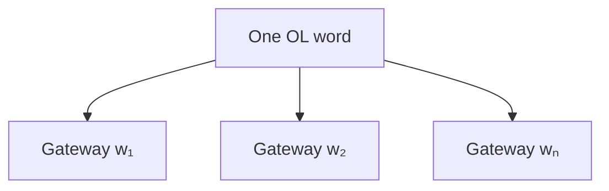
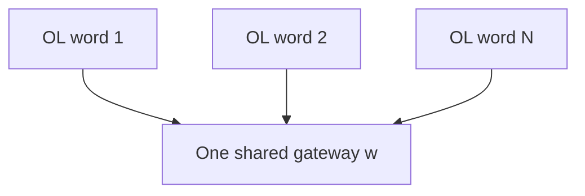
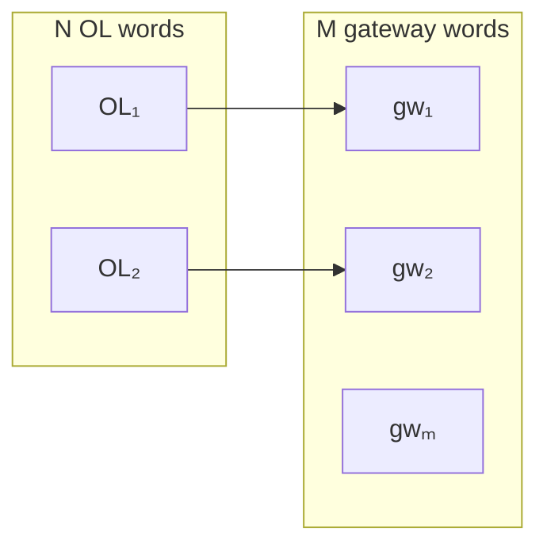
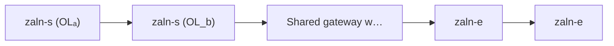
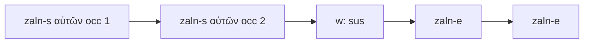
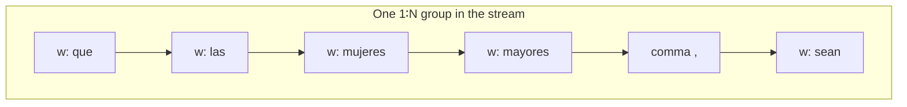
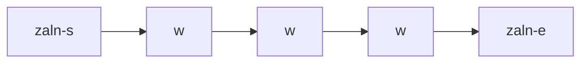
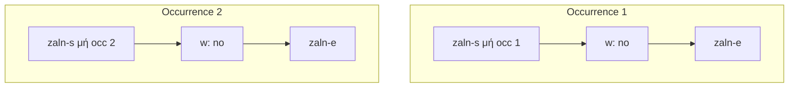
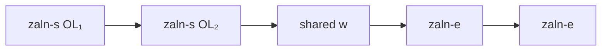

# Alignment patterns in `tit.tpl-aligned.usfm`

This note documents **recurring USFM 3 `\zaln-s` / `\w` / `\zaln-e` patterns** in the Spanish Titus TPL sample (`tit.tpl-aligned.usfm`). In this file, **gateway text** is Spanish (`\w`); **original-language** data lives only on `\zaln-s` (e.g. `x-content`, Strong’s, lemma). Line numbers refer to the file as of the documented revision.

**Terminology**

| USFM side | Role |
|-----------|------|
| `\zaln-s` … `\zaln-e` | One *alignment span* per original-language word in the group; attributes describe Greek (or other OL) without duplicating OL text in the translation stream. |
| `\w …\w*` | Gateway (translation) word tokens; occurrence metadata distinguishes repeated surfaces. |

**Invariant (typical):** For one alignment *group*, the count of `\zaln-s` equals the count of `\zaln-e`, and both equal the number of original-language words in that group. Gateway `\w` tokens for that group appear **in reading order** between the opening stack of `\zaln-s` and the closing stack of `\zaln-e` (see sections 6 and 8).

Simple diagrams below use **OL** for original-language content (described on `\zaln-s`) and **gateway** for `\w` tokens. They are schematic, not full USFM.

---

## 1. One original word → one gateway word (1∶1)

A single `\zaln-s`, one `\w`, one `\zaln-e`.


**Examples**

- **Titus 1:1** — Παῦλος → Pablo (line 13).
- **Titus 1:1** — δοῦλος → siervo (line 14).
- **Titus 1:1** — δέ → y (line 17).
- **Titus 1:1** — ἀπόστολος → apóstol (line 18).

Snippet shape:

```usfm
\zaln-s |x-content="…"\*\w SpanishWord|x-occurrence="1" x-occurrences="1"\w*\zaln-e\*,
```

---

## 2. One original word → several gateway words (1∶N)

One `\zaln-s`, then **multiple** `\w` fragments (often with punctuation or line breaks between), then **one** `\zaln-e`. In the TPL sample this is the usual encoding when **one Greek word** is rendered as **several Spanish `\w`**: a **single** milestone open/close pair, not one pair per Spanish word.



**Examples**

- **Lines 15–16** — Θεοῦ → `de` + `Dios` (two Spanish words for one Greek genitive).
- **Lines 22–24** — πίστιν → `a` + `la` + `fe` (three Spanish words).
- **Lines 46–48** — ζωῆς → `de` + `la` + `vida`.
- **Lines 114–118** — ἵνα → `para` + `que` (two `\w` before `\zaln-e` on lines 114–115).

This is the usual pattern when the **gateway** side is **non-contiguous** in the sense of *multiple surface tokens* for one OL word: the extra `\w` nodes are still **one alignment group** (one close `\zaln-e`).

---

## 3. Several original words → one gateway word (N∶1)

**Multiple consecutive `\zaln-s`** (one per OL word, in OL order), then **one** `\w` (or one merged surface), then **multiple `\zaln-e`** — one end milestone per `\zaln-s`. **Repeated `\zaln-s`** here means **several OL words** sharing **one** gateway run (not several copies of the same OL word).



**Examples**

- **Lines 71** — τὸν + λόγον → `palabra` (article + “word” → single Spanish “palabra”).
- **Lines 85–86, 106, 539** — τοῦ + Σωτῆρος → `salvador` (repeated pattern).
- **Lines 210–211** — τῇ + ὑγιαινούσῃ / διδασκαλίᾳ → `sana` / `enseñanza` (two pairs, each N∶1).
- **Line 597** — Ἰησοῦ + Χριστοῦ → single compound `Jesucristo` (two OL words → one gateway token).
- **Line 552** — παιδεύουσα + ἡμᾶς → `instruyéndonos` (verb + pronoun → one Spanish word).

Snippet shape (two OL, one gateway):

```usfm
\zaln-s |x-content="…"\*\zaln-s |x-content="…"\*\w OneSpanishWord|…\w*\zaln-e\*\zaln-e\*,
```

---

## 4. Several original words → several gateway words (N∶M)

**Multiple `\zaln-s`**, then **multiple `\w`**, then **multiple `\zaln-e`** (`N` closes for `N` opens). M can equal N (roughly word-for-word) or not.



**Examples**

- **Lines 19–20** — Ἰησοῦ + Χριστοῦ → `de` + `Jesucristo` (two OL → two gateway words; classic “of Jesus Christ” style rendering).
- **Lines 53–55** — ὁ + ἀψευδής → `que` + `no` + `miente` (two OL → three Spanish words).
- **Lines 731–732** — τῶν + ἐν + δικαιοσύνῃ → `de` + `justicia` (**three** `\zaln-s`, two `\w`, **three** `\zaln-e`).

Snippet shape:

```usfm
\zaln-s …\*\zaln-s …\*\w gw1\w*\w gw2\w*\zaln-e\*\zaln-e\*,
```

---

## 5. “Uncontiguous” original words aligned to the **same** gateway run

When **two (or more) OL words** that are **not adjacent in the Greek verse** would still map to the **same** Spanish phrase, the **translation file** still places **one block** of `\w` in order; the **duplicate information is in the milestone stack**: repeated `\zaln-s` (one per OL word), shared `\w` sequence, repeated `\zaln-e`. The OL words are **not** repeated as literal text in the Spanish stream—only their metadata appears on each `\zaln-s`.



The fixture’s **clearest stacked milestone** examples are **adjacent in the USFM line** (lines 19, 53, 71, 85, …): two or three `\zaln-s` back-to-back, then the shared `\w` run. That matches the uW/TPL convention that **each OL word gets its own `\zaln-s`**, and the **same gateway substring** aligns to all of them until all `\zaln-e` close.

**Related**

- **Line 258** — αὐτῶν (1st occurrence) + αὐτῶν (2nd occurrence) → `sus`: same lemma, **two** `\zaln-s` distinguished by `x-occurrence`, **one** `\w`, **two** `\zaln-e`.



---

## 6. Gateway stream: line breaks, commas, and other tokens between `\w`

The **same** alignment group may span **multiple physical lines** in the USFM file. **Non-`\w` tokens** (for example a comma) can also sit **between** two gateway `\w` that still belong to **one** `\zaln-s` … `\zaln-e` group—so “separated” means **something in the surface stream** other than the next `\w`, not merely wrapping.



**Examples**

- **Lines 37–40** — κατά → `es` + `de` + `acuerdo` + `con` (one `\zaln-s`, four `\w`, one `\zaln-e` after the last `\w`); separation is mostly **line breaks** between `\w`.
- **Lines 390–394** — πρεσβύτιδας → `que` + `las` + `mujeres` + `mayores` + `sean`: **five** `\w` under **one** `\zaln-s`; a **comma** follows `mayores\w*` before `\w sean` (lines 393–394).
- **Lines 718–722** — Similar splits for longer Spanish phrases.

---

## 7. Repeated gateway surface (`de`, `la`, `y`, …)

Many lines reuse Spanish function words; `\w` disambiguates with `x-occurrence` / `x-occurrences` (e.g. line 15 `de` as 1 of 6, line 28 `de` as 4 of 6). That is **not** a separate “alignment shape”—it is still 1∶N or N∶M with occurrence metadata.


Same Spanish surface in **different** `\w` nodes; `x-occurrence` / `x-occurrences` picks the correct alignment slice (not extra edges in the USFM tree).

---

## 8. Finding shapes via **repeated** `\zaln` milestones

To see how gateway words line up with OL, inspect **how `\zaln-s` / `\zaln-e` repeat**. The same visual “repetition” can mean different things:

| Situation | What repeats | What wraps each `\w` | Example in fixture |
|-----------|----------------|----------------------|--------------------|
| **A — 1∶N (TPL style)** | One `\zaln-s`, one `\zaln-e`; **multiple** `\w` between them | **One** open/close pair for **all** gateway words tied to that OL | Lines 15–16: Θεοῦ → `de` + `Dios` |
| **B — Same lemma, many verse occurrences** | Full `\zaln-s` … `\w` … `\zaln-e` **repeats** with different `x-occurrence` | **Each** span is a **different** OL instance in the verse | Lines 166–176: μή → `no` (five times, occ 1…5) |
| **C — N∶1 or stacked OL** | **Multiple** `\zaln-s` before **one** `\w` run, then **multiple** `\zaln-e` | **Several** OL words share **one** gateway block | Lines 258, 19–20 |

**A — One OL, many gateway words (single pair of milestones)**



**B — Same lemma repeated in Greek: repeated **full** spans, one `\w` each**



(The file continues similarly for occurrences 3–5 on lines 170–176.)

**C — Several OL words, one shared gateway block**



Do **not** confuse **B** with “one Greek word split into several Spanish words”: in **B**, each `\zaln-s` is a **distinct** OL occurrence; in **A**, one `\zaln-s` covers **several** `\w` for a **single** OL word.

---

## Quick reference

| Pattern | `\zaln-s` count | `\w` count | `\zaln-e` count | Example lines |
|--------|-----------------|------------|-----------------|----------------|
| 1∶1 | 1 | 1 | 1 | 13–14, 17–18 |
| 1∶N | 1 | N | 1 | 15–16, 22–24 |
| N∶1 | N | 1 (or one merged token) | N | 71, 85, 597, 552 |
| N∶M | N | M | N | 19–20, 53–55, 731–732 |

---

## See also

- [`docs/29-alignment-patterns-english-spanish.md`](../../../../../docs/29-alignment-patterns-english-spanish.md) — generic English ↔ Spanish guide with bracketed parallel lines and USFM examples.
- `rebuild-aligned.ts` (in `@usfm-tools/editor-core`) — rebuilds gateway USJ from editable text + alignment map; incremental emission keeps **gateway** word order when OL targets are non-contiguous in the Spanish stream.
- Project alignment types: `@usfm-tools/types` `AlignmentGroup` (`sources` + `targets`).
